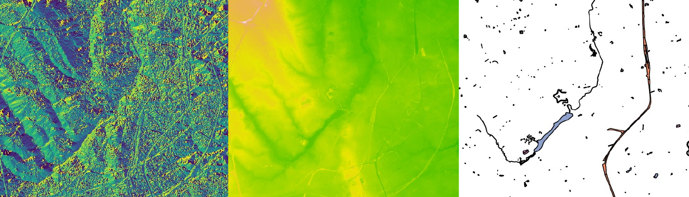

<embed src="slides/01_geographische-daten-GIS.pdf" type="application/pdf" width="100%" height="500">

## Willkommen

Geographische Informationssysteme sind ein wichtiges Werkzeug zur Verarbeitung räumlicher Daten und damit für die Beantwortung landschaftsökologischer Fragestellungen hochrelevant. Diese Kurseinheit stellt typische Fragen und Problemstellungen der einzelnen Teildisziplinen der Landschaftsökologie vor und vermittelt daran Konzepte und Anwendungen von GIS Systemen. Hier ein Auszug an Fragen und Themen des Kurses:

- Wo fließt Wasser? Topographie und Hydrologie zur Beschreibung von Landschaften. 
- Wie Bewegen sich Arten in der Landschaft? Kostenanalysen auf Basis von Geländeinformationen
- Wie lassen sich Ergebnisse interaktiv Darstellen und Vermitteln? Nutzung und Bereitstellung von Webdiensten

Aber bevor wir dazu kommen, ein kleines [Warm Up!](daten-erheben.qmd)

