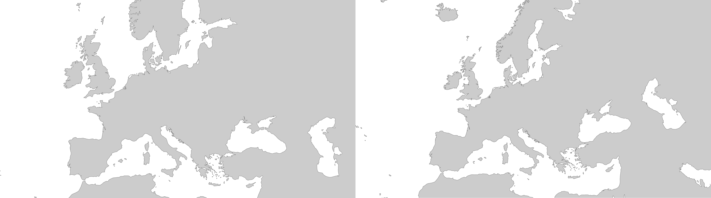

> ## Wie bekommen wir eine Kugel auf Papier?

## Einführung: Die kartografische Darstellung der Welt

Karten sind politisch. Sie sind immer auch ein Ausdruck der Kartograph*in und Abseits des (beabsichtigten) Inhalts sind Entscheidungen über die Gestaltung der Karte ein mächtiges Werkzeug der Informationsvermittlung. Welche Farbskala wird benutzt? Welche Beschriftungen werden dargestellt? Welchen Ausschnitt zeigt die Karte, welchen nicht? Welche Dimension diese scheinbar simplen Entscheidungen haben wird im nachfolgenden Video von "Mit offenen Karten" des franko-deutschen Kultursenders ARTE deutlich. 

<iframe width="560" height="315" src="https://www.youtube.com/embed/5UJ33QElhHQ?si=ed_Xoixtm2DuhOjw" title="YouTube video player" frameborder="0" allow="accelerometer; autoplay; clipboard-write; encrypted-media; gyroscope; picture-in-picture; web-share" referrerpolicy="strict-origin-when-cross-origin" allowfullscreen></iframe>

Wie im Video gezeigt, hängt die Form und Aussagekraft der Karte maßgeblich von der gewählten Projektion ab. 

## Einige ausgewählte Projektionen

### Die Mercator Projektion

Hier nochmal in Kurzform eine Animation zur Mercatorprojektion:

<iframe width="560" height="315" src="https://www.youtube.com/embed/CPQZ7NcQ6YQ?si=LrL78Lmlffoj1yCP" title="YouTube video player" frameborder="0" allow="accelerometer; autoplay; clipboard-write; encrypted-media; gyroscope; picture-in-picture; web-share" referrerpolicy="strict-origin-when-cross-origin" allowfullscreen></iframe>

- Zylindrische Projektion
- Nur am Äquator verzerrungsfrei (dort berührt der Zylinder die Kugel)
- Verzerrung nimmt mit geographischer Breite zu
- Winkeltreu, d.h. die Gitternetzlinien fallen senkrecht aufeinander

### Lambert Azimutal Equal Area

Statt eines Zylinders wird bei der Azimutalen Projektion eine Ebene an die Erdkugel angelegt. Es gibt mehrere Optionen wie genau die Erdoberfläche dann auf diese Ebene projeziert wird die in Unterschiedlichen Eigenschaften der Projektion resultieren - dazu in der Vorlesung mehr. Eine Möglichkeit ist die sogenannte Flächentreue (=Equal Area) Azimutalprojektion: 

- Nicht Winkeltreu - Gitternetzlinien beachten.
- Projektion hat ein Zentrum (dort wo die Ebene die Kugel berührt).
- European Environmental Agency nutzt diese Projektion für ihre Geodaten

## Vorlesung

<embed src="slides/01c-projektionen.pdf" type="application/pdf" width="100%" height="500">

## Übung: Projektionen in QGIS

::: {.callout-tip}
## Aufgabe: Datenprojektion vs. Kartenprojektion

- Lade folgende Daten herunter.
- Teste verschiedene Projektionssysteme.

:::

Das LIFECrossBorder Projekt hat das Ziel eine Moorfläche an der Grenze Deutschland-Niederlande zu renaturieren. Dafür wurden deutschen und niederländischen Projektpartnern Brunnen installiert die den Grundwasserstand / Moorwasserstand messen.

::: {.callout-tip}
## Aufgabe: LIFECrossBoderBog
- Lade die Daten der Province Overijssel (NL) herunter: 
- Lade die Daten der Biologischen Station Zwillbrock (DE) herunter: 
- Binde die Daten in QGIS ein.
- In welchem Bezugssystem liegen die Daten jeweils vor?
- Erstelle einen kombinierten Datensatz und exportiere ihn als Geopackage.
:::

