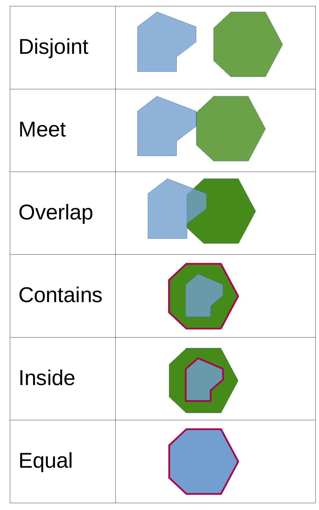

## Vorlesung

<embed src="slides/02a_Vektorbasics.pdf" type="application/pdf" width="100%" height="500">

### Das Vektordatenmodell

Bevor wir in die Praxis einsteigen, ein kurzer theoretischer Rückblick: Ein Datenmodell dient dazu, die reale Welt im GIS repräsentieren zu können. Da die Realität zu komplex ist, erfolgt dies durch eine Abstraktion. Je nachdem, ob wir diskrete Objekte (z. B. Bäume, Flüsse, Naturschutzgebiete) betrachten oder kontinuierliche Felder (z. B. Lufttemperatur, Höhe), bieten sich zwei verschiedene Datenmodelle an: das Vektormodell und das Rastermodell.In dieser Woche konzentrieren wir uns zunächst auf das Vektormodell, das Koordinatenpaare (x, y) nutzt, um geografische Objekte zu beschreiben. Da wir hier von diskreten Objekten sprechen, bedeutet dies, dass die Objekte klar definierte Grenzen haben und als einzelne, voneinander trennbare Einheiten existieren.Wir unterscheiden dabei drei grundlegende Geometrietypen:

- Punkt: Ein einzelner Koordinatenpunkt (z. B. ein Messstandort, ein einzelner Baum).
- Linie (Polyline): Eine Folge von Punkten, die durch Segmente verbunden sind (z. B. Bachläufe, Wanderwege).
- Polygon: Eine geschlossene Linie, die eine Fläche umschließt (z. B. Waldgebiet, Stadtbezirk).

Vektordaten erlauben die direkte Verknüpfung der Geometrie mit einer Attributtabelle, in der alle nicht-geometrischen Informationen (z. B. Baumart, pH-Wert, Flächennutzung) gespeichert werden.Um mit Vektordaten zu arbeiten, nutzen wir verschiedene Werkzeuge zur Analyse und Verarbeitung. 

### Vektordatenverarbeitung
Wie analysieren wir jetzt die Daten? Oft wollen wir Daten nach bestimmten Kriterien selektieren oder sie weiterverarbeiten, um neue Informationen zu generieren. Eine **Abfrage (Query)** liefert eine Antwort oder eine Auswahl (z. B. „Welche Flächen sind Moore?“ $\rightarrow$ Ergebnis: Es werden nur die Polygone ausgewählt, auf die diese Bedingung zutrifft). Die Originaldaten bleiben unverändert.
Eine **Operation (Processing)** erzeugt ein neues Produkt oder verändert die Daten (z. B. ein Buffer $\rightarrow$ Ergebnis: ein neuer Polygon-Layer). Je nachdem, ob wir uns für die Attribute, die Geometrien oder die Topologien (also die räumliche Anordnung) interessieren, lassen sich diese Vorgänge in drei Kategorien unterteilen:

- Thematische Analysen: Wählt die Objekte aus, deren Eigenschaften (Attribute) die vorgegebenen Bedingungen erfüllen – z. B.: „Selektiere alle Bäume der Art Fichte.“
- Geometrische Analysen: Wählt die Objekte aus, die bestimmte räumliche Maße oder Distanzbedingungen erfüllen – z. B.: „Selektiere alle Bäume, die weniger als 250 m vom Fluss entfernt sind.“
- Topologische Analysen: Wählt die Objekte aus, die in einer bestimmten räumlichen Beziehung zu anderen Objekten stehen – z. B.: „Selektiere alle Bäume, die sich innerhalb des Stadtgebiets von Münster befinden.“

### Thematische Abfragen und Analysen
Hier erfolgt die Auswahl von Geoobjekten rein auf Grundlage ihrer Attributwerte. Im Gegensatz zu räumlichen Analysen handelt es sich um nicht-raumbezogene Abfragen: Es geht also nicht darum, wo ein Objekt liegt, sondern welche Eigenschaften in der Attributtabelle hinterlegt sind.

In QGIS wird dies über den Ausdruckseditor gelöst, der entweder direkt über die Attributtabelle oder über die Funktion „Objekte nach Ausdruck auswählen“ angesteuert werden kann.

Um eine Abfrage zu erstellen, muss die fachliche Frage in eine formale Bedingung übersetzt werden. Dieser Prozess erfolgt in zwei Schritten:

- Identifikation: Welche Attribute (Spalten) sind für die Fragestellung relevant?
- Formulierung: Wie muss der Ausdruck aufgebaut sein, um die gewünschten Objekte zu isolieren?

Dafür müssen die gängigsten Operatoren bekannt sein:

- Auswahloperatoren: Dienen dem gezielten Abrufen von Werten (z. B. IN für eine Liste von Werten).
- Vergleichsoperatoren: Prüfen auf Gleichheit oder Größenunterschiede
  - **=** gleich
  - **<>** ungleich (in anderer Software oft auch **!=**)
  - **<** kleiner als
  - **>** größer als
  - **>=** größer oder gleich
  - **<=** kleiner oder gleich.
- Arithmetische Operatoren: Ermöglichen Berechnungen innerhalb der Abfrage (z. B. **+**, **-**, *****, **/**).
- Logische Operatoren: Diese kommen zum Einsatz, sobald mehrere Bedingungen gemeinsam ausgewertet werden sollen. Sie verknüpfen einzelne Aussagen zu komplexeren Auswahlregeln:
  - **AND**: Beide Bedingungen müssen erfüllt sein.
  - **OR**: Mindestens eine der Bedingungen muss erfüllt sein.
  - **NOT**: Negiert eine Bedingung (kehrt das Ergebnis um).
  - **XOR**: Genau eine der Bedingungen muss erfüllt sein, aber nicht beide gleichzeitig.

Neben thematischen Abfragen zählt auch die Tabellenverknüpfung (Join) zu den thematischen Analysen. Ein Join ist eine Operation, bei der zwei Tabellen basierend auf einem gemeinsamen Merkmal (einem sogenannten Schlüsselfeld oder Unique Identifier) miteinander verknüpft werden. In der GIS-Praxis bedeutet das meist, dass eine externe Tabelle (z. B. eine Excel-Liste oder eine CSV-Datei) an einen räumlichen Layer angehängt wird. Das Ziel ist es, die Attributtabelle eines Objekts zu erweitern, ohne die Geometrie des Objekts zu verändern.

### Geometrische Abfragen und Analysen

Im Gegensatz zu thematischen Analysen werten geometrische Abfragen nicht die Attributwerte aus, sondern die Geometrie der Geoobjekte. Hier steht die räumliche Form, die Größe oder die exakte Position im Vordergrund.

Geometrische Abfragen dienen dazu, Informationen über die Beschaffenheit eines Objekts oder seine räumliche Beziehung zu anderen Objekten zu erhalten, ohne den Datensatz zu verändern. Beispiele hierfür sind:

- Flächen- und Längenberechnungen: Ermittlung der Fläche eines Polygons, des Umfangs oder der Länge einer Linie (z. B. „Wie viele Hektar umfasst dieses Biotop?“).
- Distanzanalysen: Messung des Abstands zwischen zwei Objekten (z. B. „Wie weit ist der nächste Messpunkt vom Bach entfernt?“).
- Reichweitenanalysen: Prüfung, ob ein Objekt innerhalb eines bestimmten Radius liegt (z. B. „Welche Standorte befinden sich im Umkreis von 500 m um die Siedlung?“).

Neben diesen reinen Abfragen gibt es geometrische Standardverarbeitungswerkzeuge. Diese basieren zwar ebenfalls auf geometrischen Abfragen, liefern jedoch als Ergebnis neue, verarbeitete Daten (neue Layer). Zu den wichtigsten Operationen gehören:

- Buffer (Puffer): Erzeugt eine neue Fläche in einem definierten Abstand um ein Objekt (z. B. ein 10 m breiter Schutzstreifen entlang eines Gewässers).
- Clip (Ausschneiden): Schneidet einen Layer mithilfe eines anderen Layers (der „Maske“) zu, sodass nur die Objekte innerhalb der Maske erhalten bleiben.
- Dissolve (Auflösen): Verschmilzt benachbarte Polygone zu einer größeren Einheit, sofern sie ein gemeinsames Attribut teilen.
- Intersection (Verschneiden): Kombiniert zwei Layer und behält nur die Bereiche, die räumlich überlappen. Dabei werden sowohl die Geometrien verschnitten als auch die Attribute beider Layer kombiniert.

### Topologische Abfragen und Analysen

Während geometrische Analysen konkrete Maße (wie Meter oder Hektar) berechnen, konzentrieren sich topologische Abfragen auf die räumlichen Beziehungen zwischen Objekten. Hier geht es nicht um Distanzen, sondern um die Prüfung spezifischer räumlicher Bedingungen (sog. topologische Prädikate).

Klassische topologische Abfragen prüfen beispielsweise:

- Berührung (Touches): Haben zwei Objekte eine gemeinsame Grenze, ohne dass ihre Flächen überlappen? (z. B. „Grenzt die Waldfläche an das Feld?“)
- Überlappung (Overlaps): Teilen sich zwei Objekte einen Raum, ohne dass eines das andere vollständig umschließt?
- Enthaltensein (Contains / Within): Liegt ein Objekt vollständig innerhalb eines anderen? (z. B. „Liegt der See vollständig innerhalb des Naturschutzgebiets?“)
- Schnittmenge (Intersects): Haben zwei Objekte irgendeinen gemeinsamen Punkt? (Die allgemeinste Form der räumlichen Beziehung).

{#fig-intersections width="30%"}

Auf diesen grundlegenden Abfragen basieren komplexere topologische Analysen und Operationen:

- Spatial Join (Räumliche Verknüpfung): Nutzt eine topologische Abfrage (z. B. „liegt in“), um Informationen zwischen Tabellen zu übertragen. Anstatt einer ID wie bei den thematischen Analysen, wird die räumliche Beziehung als „Schlüssel“ genutzt, um Attribute eines Polygons auf darin liegende Punkte zu übertragen.
- Nächster Nachbar (Nearest Neighbor): Sucht das Objekt mit der engsten topologischen Bindung (kürzester Abstand), um Netzwerke oder Nachbarschaften zu definieren.
- Konnektivität: Prüft in Liniennetzwerken, ob Segmente an Knotenpunkten verbunden sind (z. B. „Ist das Gewässernetz lückenlos verbunden?“).

## Übung

:::{.callout-tip}
## Aufgabe
Lade das [Baumkataster](https://opendata.stadt-muenster.de/dataset/digitales-baumkataster-m%C3%BCnster/resource/096c4fc2-cfdb-4b9b-840f-da9e638e65ec), das [Geo1](https://uni-muenster.sciebo.de/s/dwzzsNBSAs5xBW9) und die [Stadtgrenzen von Münster](https://opendata.stadt-muenster.de/sites/default/files/05515000_shp_stadtbezirk.zip) herunter. Beantworte folgende Fragen:

1. Wieviele Eichen stehen im Münster Mitte? (Tip: Hier brauchst du eine räumliche Verschneidung sowie eine thematische Abfrage)

2. Wo steht die nächstgelegende Birke vom Geo1 (Tip: Verwende das Werkzeug "Distance Matrix": Dieses Werkzeug berechnet die Distanz zwischen allen Punkten eines Start-Layers (z. B. Geo1) und allen Punkten eines Ziel-Layers (z. B. Birken). Das Ergebnis ist eine neue Tabelle, aus der du den kürzesten Abstand (Minimum) einfach herausfiltern kannst.)

:::

